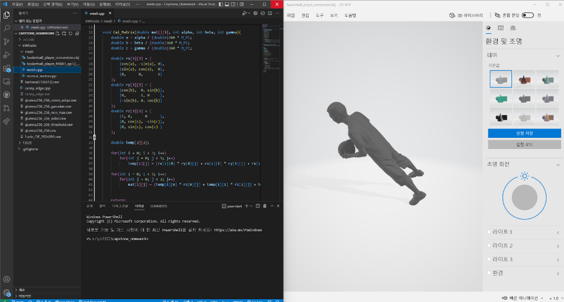
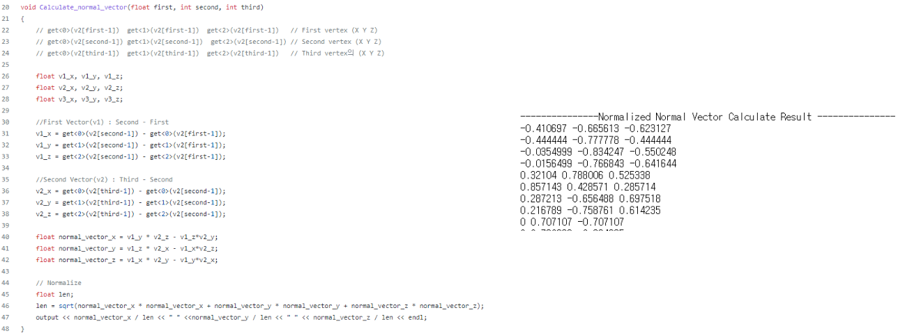
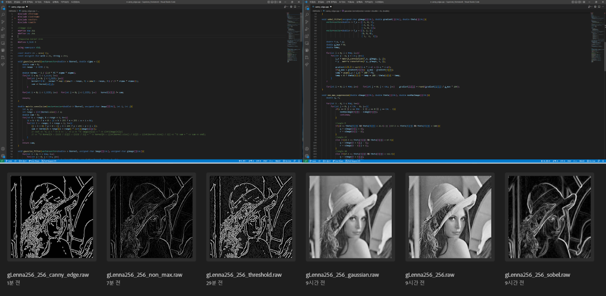

# 🏤산학협력SW프로젝트 Homework🏬

---
**Participants**
> 🐱‍💻[syw2045](http://github.com/syw2045)
> 💻[KiKi-Daehaksaeng](https://github.com/KiKi-Daehaksaeng)
> 🎱[6Whistle](https://github.com/6Whistle)
> ⚾[dlwnsgud8406](https://github.com/dlwnsgud8406)
> 👕[angrymusic](https://github.com/angrymusic)

---
**Purpose**
- 프로젝트를 진행하기 앞서 프로젝트에 대해 필요한 지식을 이해함과 동시에 응용 및 적용하는 방법을 익히기 위해 과제를 수행함.

---
# 📖과제 목록
1. Rotation
2. Normal vector
3. Canny edge detection

## 1. Roatation

`Euler Angle`을 이용하여 `3D Object`를 회전하는 과제

## 2. Normal vector

`vertex`와 `edge` 배열을 저장하고 공식을 통해 각 `edge`의 `normal vector`를 출력하는 과제

## 3. Canny edge detection

`OpenCv api`를 사용하지 않고, `Canny edge detection`을 구현하는 과제

### 구현 방식
1. `Gaussian Filter`를 통해 노이즈 제거
2. `Sobel filter`를 통해 `gradient`와 `theta` 획득
3. `gradient`와 `theta`를 바탕으로 `Non-max suppression`을 통해 선분의 방향을 확인하여 굵기 조절
4. 2개의 `threshold`를 사용하여 선분의 강도 선별
5. `Hysteresis`를 통해 강한 선분과 약한 선분의 연관 관계를 확인하여 노이즈 제거
